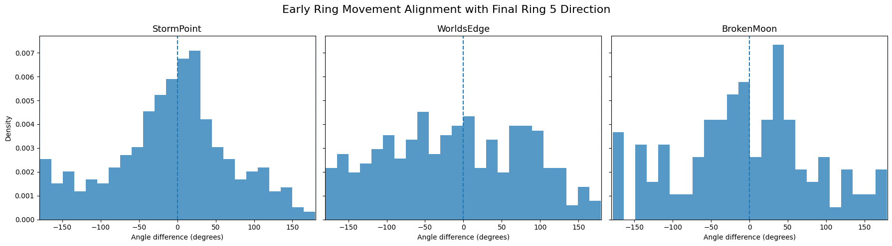
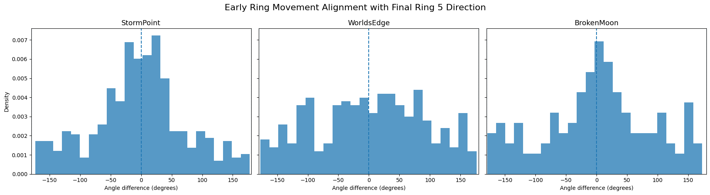
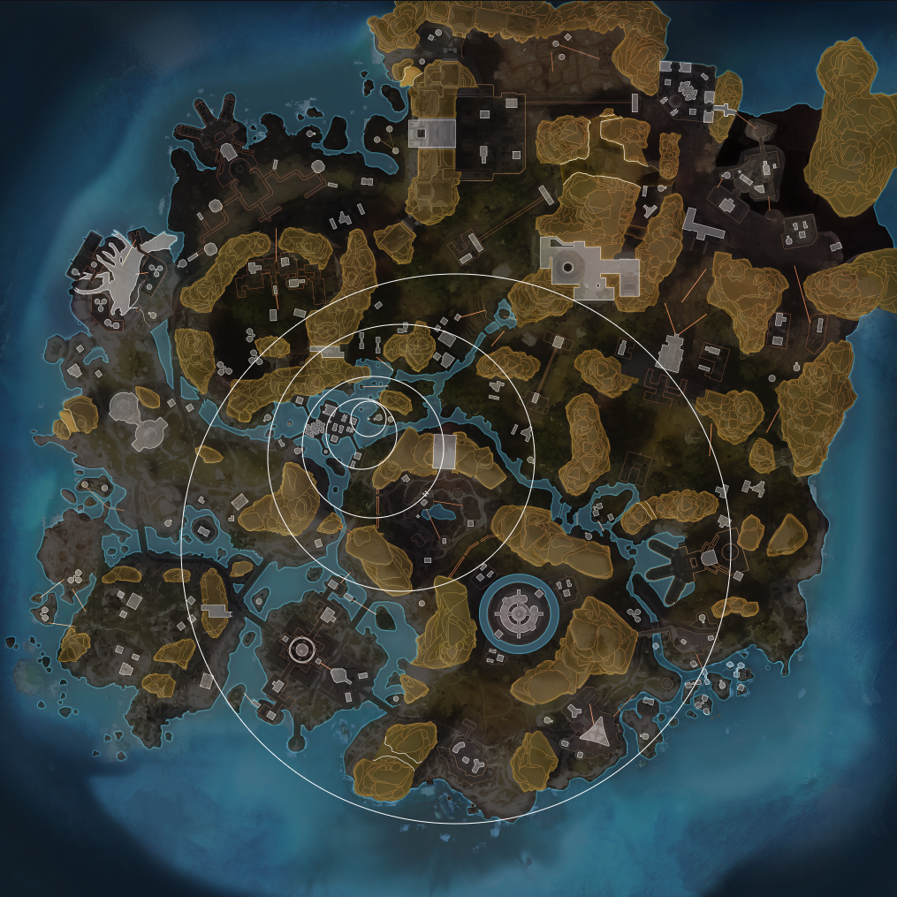
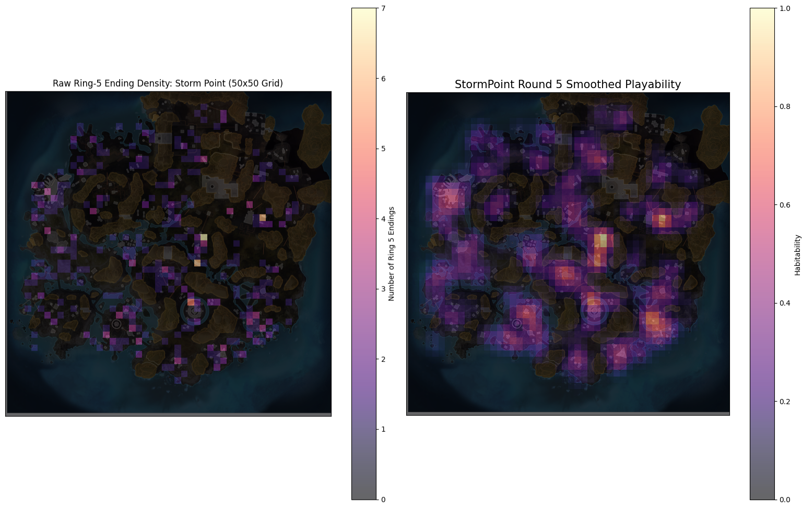
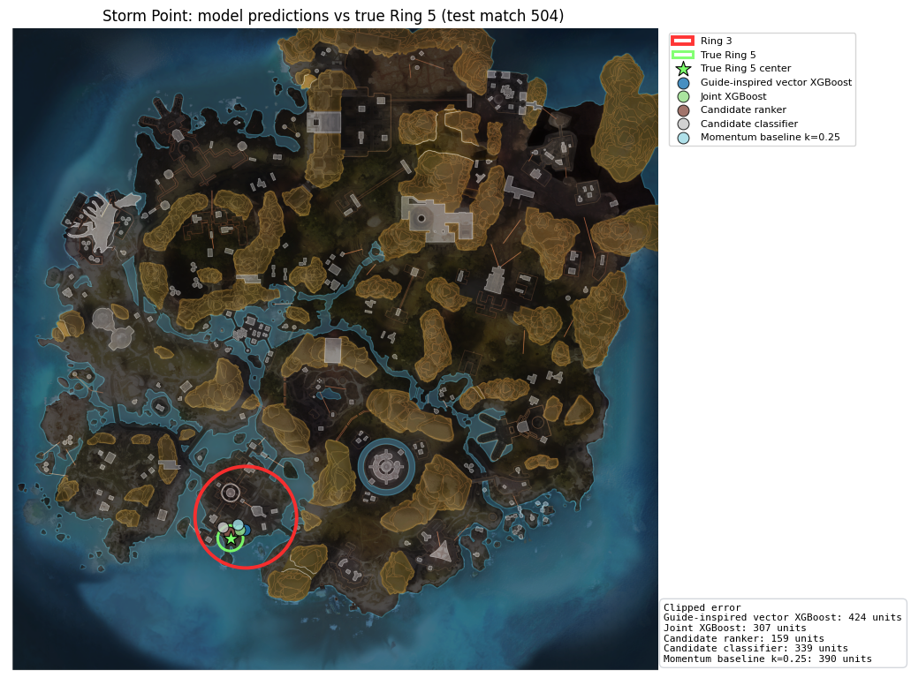
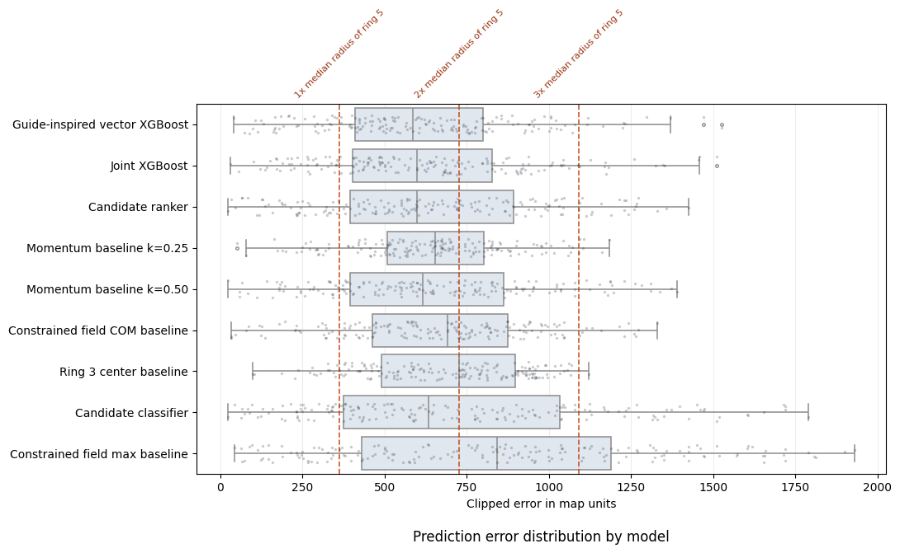

# Apex Legends Endzone Prediction with Constrained Spatial Machine Learning

## 1. Motivation

{ width=60%}

*Figure 1. Prediction setup. The model uses information from Rings 1–3 to predict the center of Ring 5. Later rings are not used as input, making this an early-game prediction task.*

In *Apex Legends*, ring prediction is an important strategic skill. As the game progresses, the playable area shrinks through a sequence of circular zones, forcing teams to rotate, take positions, and decide whether to play edge or zone. Being able to anticipate the later rings, especially Ring 5, can provide a meaningful advantage because teams can position earlier, avoid contested rotations as well as control strategically advantageous locations like places with cover.

This project explores whether machine learning can predict the center of Ring 5 using only information available up to Ring 3. The goal is not just to train a model, but to understand how predictable the final zone actually is from early-ring information. In particular, I investigate three sources of signal:

1. **Ring movement**: whether the direction of earlier ring pulls contains useful momentum.
2. **Map priors**: whether certain maps have historically common Ring 5 locations.
3. **Game constraints**: future rings must fit inside previous rings, so the Ring 5 center is geometrically constrained by Ring 3.

The initial goal was to predict the exact Ring 5 center as accurately as possible. However, the results showed that the task is more difficult than a standard coordinate-regression problem. Several plausible Ring 5 locations can exist within the same Ring 3, so the problem appears to be partly multimodal. Because of this, the project explores direct coordinate regression, guide-inspired feature engineering, and a candidate-selection framing.

## Key Takeaways

- Built a custom spatial dataset of 865 Apex Legends matches by extracting, cleaning, and standardising match-level ring data.
- Formulated final-ring prediction as a constrained spatial ML problem using only Rings 1–3.
- Engineered Ring-3-relative coordinates, map-specific spatial priors, geometric containment constraints, and guide-inspired vector features.
- Benchmarked simple heuristics, XGBoost regression, candidate ranking, and candidate classification.
- Found that exact Ring 5 prediction from early rings is noisy and partly multimodal, but guide-inspired spatial features and self-researched features improved over all simple baselines.

## 2. Data
The dataset was built from scratch by writing Python scripts to extract, parse, clean, and standardise match-level ring records. This makes the project an end-to-end data collection and modelling pipeline rather than an analysis of a pre-existing benchmark dataset.

Each row represents one match. The dataset contains the full ring sequence from Ring 1 to Ring 5, including each ring's center coordinate, radius, shrink timing, and timestamp.

| Column | Description |
|---|---|
| `match_id` | Unique identifier for each match. |
| `map` | Map where the match was played, e.g. `StormPoint`, `WorldsEdge`, `BrokenMoon`. |
| `total_rings` | Number of rings recorded for the match. This project keeps matches with Ring 5 available. |
| `ring{i}_stage` | Ring stage number, where `i` ranges from 1 to 5. |
| `ring{i}_x` | X-coordinate of the center of Ring `i` in the map coordinate system. |
| `ring{i}_y` | Y-coordinate of the center of Ring `i` in the map coordinate system. |
| `ring{i}_radius` | Radius of Ring `i`, in game/map units. |
| `ring{i}_shrink` | Shrink-related timing value for Ring `i`. This was not used directly in the final model. |
| `ring{i}_t` | Ring event time value. It was not used directly in the final model. |
| `ring{i}_ts` | Unix Time value for the ring event. It was not used directly in the final model. |

*Table 1. Description of Variables*

The prediction target is the Ring 5 center:

```text
ring5_x, ring5_y
```

## 3. Problem Formulation

The main prediction task is: 
```text
Given Rings 1, 2, and 3, predict the center of Ring 5.
```
This is useful information because if we can predict Ring 5 early enough, using only Rings 1, 2, and 3, it provides a significant strategic advantage. By the time Ring 4 is revealed, most players can already infer where Ring 5 will be, so the value of the prediction diminishes greatly.

A naive way to model this is direct coordinate regression:
```text
features -> (ring5_x, ring5_y)
```
However, absolute map coordinates are not ideal because every match has a different Ring 3 center and radius. To make the learning problem more consistent, I represent the Ring 5 target relative to Ring 3:

```text
target_rel_x = (ring5_x - ring3_x) / ring3_radius
target_rel_y = (ring5_y - ring3_y) / ring3_radius
```
The model predicts this relative coordinate, and predictions are converted back to exact map coordinates after inference:
```text
pred_ring5_x = pred_rel_x * ring3_radius + ring3_x
pred_ring5_y = pred_rel_y * ring3_radius + ring3_y
```
This keeps the final output as an exact Ring 5 coordinate while making the model learn a normalised version of the problem.


## 4. Exploratory Data Analysis

### 4.1 Data Composition

Only data for 3 maps were collected, `StormPoint`, `WorldsEdge`, `BrokenMoon`. After data-cleaning, the counts are as follows:

| map | no. of matches |
|---|---|
| `StormPoint` | 397 |
| `WorldsEdge` | 340 |
| `BrokenMoon` | 128 |

*Table 2. Count by Map*

|  | count | mean | std | min | 25% | 50% | 75% | max |
|---|---|---|---|---|---|---|---|---|
|`ring5_radius`|865|346.269364|26.456118|33.0|321.0|364.0|364.0|381.0|

*Table 3. Summary Statistics of the radius of Ring 5*

There is a single observation with `ring5_radius` = `33`. It is erroneous, however, the other variables were verified to be correct. As such, calculations involving the x and y coordinates still utilised this observation.


### 4.2 Spatial Clustering of Later Rings

{ width=100% }

*Figure 2. Late-Ring Spatial Distribution*

Figure 2 shows that Rings 4 and 5 are not uniformly distributed across each map. Instead, their centers cluster in map-specific regions. This suggests that final-ring locations are influenced by spatial structure in the map, rather than being purely random. This observation motivates using map-specific spatial priors as part of the feature engineering process.

### 4.3 Ring Movement Analysis
{ width=100% }

*Figure 3. Angle Difference: Ring 2 to 3 vs Ring 3 to 5*

{ width=100% }

*Figure 4. Angle Difference: Ring 1 to 2 vs Ring 3 to 5*

The alignment plots suggest that early ring movement has some directional relationship with the eventual Ring 5 displacement, although the relationship is noisy. This motivates including a momentum feature based on the change in pull direction between Ring 1 to Ring 2 and Ring 2 to Ring 3.

Because momentum is an angle, I do not use the raw angle value directly. Angles are circular: for example, -179 degrees and 179 degrees represent nearly the same direction, but numerically they appear far apart. To avoid this discontinuity, I encode momentum using sine and cosine:
$$
\begin{aligned}
\text{momentum\_sin} &= \sin(\theta), \\
\text{momentum\_cos} &= \cos(\theta),
\end{aligned}
$$

$$
\text{where } \theta \text{ is the wrapped change in direction between consecutive ring pulls.}
$$

### 4.4 Game Constraints
A key game constraint is that Ring 5 must fit inside Ring 3. If ring3_radius is the Ring 3 radius and ring5_radius is the Ring 5 radius, then the Ring 5 center must satisfy:
```text
distance(ring3_center, ring5_center) <= ring3_radius - ring5_radius
```
{ width=60% }

*Figure 5. Example of how `ring{j}` must fit within `ring{i}`, where `j > i`. Year 6, Split 1 Pro League - EMEA - Day 6 B vs. C Game #3 via apexlegendsstatus.com*


In this project, I use a conservative Ring 5 radius cap of 381 units, based on the maximum valid Ring 5 radius observed in the dataset. This gives the feasible constraint:

```text
distance(ring3_center, ring5_center) <= ring3_radius - 381
```
This constraint is used to limit the valid prediction region.

## 5. Feature Engineering

The feature engineering process translates the main EDA findings into model inputs. The goal is not simply to add many variables, but to represent the prediction problem in a way that matches the structure of the game. In particular, the features are designed around three ideas: early ring movement may contain directional signal, each map has its own historical final-ring tendencies, and Ring 5 must remain geometrically feasible within Ring 3.

All match-specific features use only information available up to Ring 3. Historical Ring 5 locations are used only to build map-level spatial priors, and these priors are built from the training split only during evaluation. This prevents test-set Ring 5 locations from leaking into the features used to predict those same examples.

### 5.1 Relative Coordinate Features

Because matches occur in different parts of the map and Ring 3 can have different centers and radii, I avoid modeling Ring 5 only as an absolute map coordinate. Instead, the target is expressed relative to Ring 3, as described in the problem formulation:

```text
target_rel_x = (ring5_x - ring3_x) / ring3_radius
target_rel_y = (ring5_y - ring3_y) / ring3_radius
```

This means the model learns where Ring 5 is located within the Ring 3 frame of reference. A prediction of `(0, 0)` corresponds to the Ring 3 center, while larger positive or negative values represent offsets from that center. This representation makes examples more comparable across matches because the model is learning a normalized spatial relationship rather than memorizing raw map coordinates.

The same idea is used for early ring movement. The movement from Ring 1 to Ring 2 and from Ring 2 to Ring 3 is converted into displacement vectors and normalized by the relevant earlier ring radius:

```text
r1_r2_dx_norm = ring1_ring2_dx / ring1_radius
r1_r2_dy_norm = ring1_ring2_dy / ring1_radius
r2_r3_dx_norm = ring2_ring3_dx / ring2_radius
r2_r3_dy_norm = ring2_ring3_dy / ring2_radius
r2_r3_dist_norm = ring2_ring3_dist / ring2_radius
```

These variables describe how strongly and in what direction the zone has already pulled, while accounting for the scale of the ring at that stage.
### 5.2 Momentum / Vector Features
### 5.2a Momentum Features

The EDA suggested that early ring movement has some relationship with the eventual Ring 5 displacement, although the signal is noisy. To capture this, I include a momentum feature based on the change in direction between consecutive ring pulls. First, the angle of each ring-to-ring movement is calculated using the displacement vector. Then the change in angle from Ring 1 to Ring 2 and Ring 2 to Ring 3 is wrapped onto the interval $[-\pi, \pi]$.

Rather than using the raw momentum angle directly, I encode it using sine and cosine:

```text
ring2_momentum_sin = sin(ring2_momentum)
ring2_momentum_cos = cos(ring2_momentum)
```

This avoids the discontinuity that occurs with circular variables, where two directions can be almost identical geometrically but far apart numerically. The sine and cosine representation allows the model to learn from pull direction without treating the angle boundary as a meaningful jump.

### 5.2b Vector Features
In addition to the baseline feature set, I tested a vector-based feature design inspired by human ring-prediction heuristics. Instead of representing movement only through raw distances, angles, or momentum terms, this approach generates explicit candidate pull directions from the early ring vectors. The vector-first feature set was inspired by a community guide on Apex endzone prediction, which describes using vector addition/subtraction, counterpulls, and map-specific endzone clustering as part of human ring prediction heuristics [1].

In addition to the baseline feature set, I tested a vector-first feature design inspired by human ring-prediction heuristics. Instead of representing movement only through raw distances, angles, or momentum terms, this approach generates explicit candidate pull directions from the early ring vectors.

Let $$V_{12} = c_2 - c_1 \qquad \text{and} \qquad V_{23} = c_3 - c_2$$

where $c_i$ is the center of Ring $i$. I constructed several vector-based candidate locations using combinations of these early pulls:

- `vec_add`: continuation-style vector addition
- `vec_counter`: counterpull-style subtraction
- `vec_alt`: an alternative counterpull direction

Each vector candidate was converted into Ring-3-relative coordinates and clipped to the feasible Ring 5 center region:

$$
d(c_3, c_5) \le r_3 - 381
$$

I then scored each candidate using the map-specific spatial prior and computed agreement features between the vector candidates and the constrained field summaries, such as distance to the field center of mass and distance to the field maximum.

This feature set tests whether human-style vector prediction rules add useful signal beyond the constrained heatmap and basic movement features.

### 5.3 Feasible Ring 3 Geometry

A key constraint is that Ring 5 must fit inside Ring 3. Using the conservative Ring 5 radius cap of `381`, the feasible radius for the Ring 5 center is:

```text
feasible_radius = ring3_radius - 381
```

This is then normalized by the Ring 3 radius:

```text
feasible_radius_norm = feasible_radius / ring3_radius
```

This feature tells the model how much room remains for Ring 5 to move inside Ring 3. A smaller feasible radius means the later ring center is more tightly constrained, while a larger feasible radius allows more possible final-ring locations.

### 5.4 Map Playability Field

The spatial EDA showed that later rings are not uniformly distributed. Ring 5 centers tend to cluster in map-specific areas, which suggests that map geometry and playable terrain influence final-zone locations. To represent this, I build a separate playability field for each map.

For each map, historical Ring 5 centers from the training data are placed into a `50 x 50` grid over the map coordinate space. The resulting heatmap is smoothed with a Gaussian filter, using a smoothing scale based on the median observed Ring 5 radius. The smoothed field acts as a probability-like surface: higher values indicate regions where Ring 5 has historically appeared more often.

{ width=100% }

*Figure 6. Illustration of the playability-field construction using the full dataset for visualisation only. In the modeling pipeline, the same smoothing process is applied to the training split only to avoid test-set leakage*

Importantly, this field is not used directly over the whole map for each prediction. For a given match, the field is restricted to the feasible region inside that match's Ring 3. This combines the historical map prior with the actual geometry of the current game.

From the constrained field, I extract several summary features:

| Feature | Meaning |
|---|---|
| `field_mass` | Total playability-field mass inside the feasible Ring 3 region. |
| `field_com_x`, `field_com_y` | Center of mass of the feasible playability field, expressed relative to Ring 3. |
| `field_max_x`, `field_max_y` | Highest-scoring feasible field location, expressed relative to Ring 3. |
| `field_spread` | How concentrated or diffuse the feasible playability mass is. |
| `field_forward_mean` | Average feasible field position along the Ring 2 to Ring 3 movement direction. |
| `field_lateral_mean` | Average feasible field position perpendicular to the Ring 2 to Ring 3 movement direction. |
| `field_forward_mass` | Share of feasible field mass lying ahead of the Ring 2 to Ring 3 movement direction. |

*Table 4. Description of Features derived from Constrained Playability Field*

These features allow the model to reason about both where Ring 5 has historically been likely and whether those locations are currently possible given the observed Ring 3.

### 5.5 Candidate-Based Features

In addition to the regression features, I construct a small set of interpretable candidate Ring 5 locations. These candidates are used by the candidate-ranking and candidate-classification approaches later in the project. The candidate set includes:

| Candidate | Description |
|---|---|
| `center` | The Ring 3 center, equivalent to predicting no additional movement. |
| `mom025` | A momentum continuation point using `0.25` times the Ring 2 to Ring 3 displacement. |
| `mom05` | A momentum continuation point using `0.50` times the Ring 2 to Ring 3 displacement. |
| `field_com` | The center of mass of the constrained playability field. |
| `field_max` | The strongest single location in the constrained playability field. |

*Table 5. Description of Candidates*

For the direct regression model, the momentum candidates are also included as features:

```text
cand_mom025_x, cand_mom025_y
cand_mom05_x, cand_mom05_y
```

I also include distances between these candidate locations and the constrained field summaries, such as:

```text
mom025_to_com_dist
mom05_to_com_dist
max_to_com_dist
```

For the candidate-selection models, each match is expanded into one row per candidate. Candidate-level features include the candidate's relative position, its distance from the field center of mass and field maximum, its playability-field score, its alignment with recent ring movement, and the candidate type. This reframes the problem from predicting any possible coordinate to choosing among a small set of plausible, game-informed locations.

## 6. Baselines

Before fitting machine learning models, I evaluate a set of simple baselines. These baselines are important because the prediction task has strong built-in structure: Ring 5 is constrained by Ring 3, early ring movement may already provide directional information, and some map areas are historically more likely to contain final zones. A learned model is only useful if it improves on these simple, interpretable rules.

All baseline predictions are made in the same Ring 3-relative coordinate system used by the models. This keeps the comparison fair, since each baseline predicts an offset from the Ring 3 center and is then converted back into map coordinates for evaluation. Predictions are also evaluated with the same feasible-region clipping used elsewhere in the project.

### 6.1 Ring 3 Center Baseline

The simplest baseline predicts that Ring 5 will be centered exactly at the Ring 3 center:

```text
pred_rel_x = 0
pred_rel_y = 0
```

This baseline tests how much predictive value comes from doing nothing beyond assuming that the final ring remains near the current playable area's center. It is intentionally simple, but useful as a reference point because any practical model should outperform it.

### 6.2 Momentum Continuation Baselines

The momentum baselines assume that the Ring 2 to Ring 3 pull direction continues toward Ring 5. I test two versions, using `25%` and `50%` of the Ring 2 to Ring 3 displacement:

```text
pred_rel_x = k * ring2_ring3_dx / ring3_radius
pred_rel_y = k * ring2_ring3_dy / ring3_radius
```

where:

```text
k = 0.25 or 0.50
```

These baselines are deliberately lightweight. They do not use map history or machine learning; they only ask whether the most recent observed ring movement contains useful directional signal. Their performance is especially important because the EDA suggested that early ring movement has some relationship with the eventual Ring 5 displacement.

### 6.3 Constrained Playability Field Baselines

The playability-field baselines use the train-only map playability field described in the feature engineering section. For each test match, the map-level field is restricted to the feasible region inside that match's Ring 3. I then evaluate two simple predictions from this constrained field.

The first uses the center of mass of the feasible playability field:

```text
pred_rel_x = field_com_x
pred_rel_y = field_com_y
```

This baseline predicts the average historically likely Ring 5 position within the current feasible region. It is less sensitive to a single high-value cell and gives a smooth summary of the map prior.

The second uses the maximum-value location in the feasible playability field:

```text
pred_rel_x = field_max_x
pred_rel_y = field_max_y
```

This baseline predicts the single most historically likely feasible location. It is more aggressive than the center-of-mass baseline because it commits to one peak in the smoothed playability surface.

### 6.4 Baseline Performance

The baseline results on the current leakage-free evaluation split are:

| Baseline | Mean clipped error | Median clipped error | Mean normalized error |
|---|---:|---:|---:|
| Momentum baseline k=0.25 | 646.000 | 653.236 | 1.864 |
| Momentum baseline k=0.50 | 648.381 | 617.387 | 1.869 |
| Constrained field COM baseline | 666.388 | 691.642 | 1.925 |
| Ring 3 center baseline | 685.353 | 727.632 | 1.981 |
| Constrained field max baseline | 841.874 | 841.590 | 2.425 |

*Table 6. Summary of Baselines*

The momentum baselines perform best among the simple approaches, which supports the idea that recent ring movement contains useful signal. The constrained field center of mass also improves over the Ring 3 center baseline, showing that the map-level spatial prior is informative. However, the constrained field maximum performs poorly, suggesting that choosing a single highest-probability grid cell is too brittle. The smoothed field is useful, but its center of mass is a more stable summary than its maximum. It may also suggest that according to the game engine, there are multiple valid ring 5 locations.

Together, these baselines set the standard for the learned models. In particular, a model must improve on the best momentum baseline, which has a mean clipped error of about `646` map units, to show that it is learning more than a simple continuation of the Ring 2 to Ring 3 pull.

## 7. Regression Models

The first learned approach treats Ring 5 prediction as a coordinate regression problem. The model predicts the Ring 5 center in the Ring-3-relative coordinate system and the prediction is then converted back to map coordinates for evaluation.

I use XGBoost with `multi_output_tree` so the two-dimensional target is predicted jointly. This matters because Ring 5 is a spatial outcome: the `x` and `y` coordinates should not be learned as unrelated targets.

The standard regression feature set uses:

- Ring 1 to Ring 3 movement features
- momentum encoded with sine and cosine
- map identity
- constrained spatial field summaries
- feasible Ring 3 containment geometry
- Ring-3-relative targets

The standard Joint XGBoost model reaches a mean clipped error of `619.263`, improving over the best simple baseline (`646.000`) by `26.738` map units.

## 8. Testing Pre-Existing Knowledge

This section tests features inspired by ccamfpsApex’s Ring Prediction Guide. I treat the guide as pre-existing player knowledge and translate its ideas into trainable features, rather than using it as a hard-coded answer key.

The guide-inspired model uses only information available by Ring 3, plus the train-only map playability field. Its additional features include:

| Feature idea | Implementation |
|---|---|
| Continuation / vector addition | Combine the Ring 1 to 2 and Ring 2 to 3 pull vectors into a `vec_add` candidate. |
| Counterpull reasoning | Build `vec_counter` and `vec_alt` candidates from differences between early pull vectors. |
| Hard-pull vs centering-up behavior | Add edge-gap features that measure how close each early ring was to touching the previous ring edge. |
| Game legality | Clip each vector candidate to the feasible Ring 5 center region inside Ring 3. |
| Map context | Score each vector candidate on the constrained train-only playability field and measure distance to field COM/max. |

*Table 7. Summary of ideas mentioned in ccamfpsApex's guide*

This section is important for the case study because it tests whether informal game knowledge can become measurable model signal. In the cleaned pipeline, all guide-inspired features are evaluated without test-set leakage.

By map, the guide-inspired model performs as follows:

| Map | Mean clipped error | Median clipped error | Mean normalized error | Test matches |
|---|---:|---:|---:|---:|
| BrokenMoon | 651.464 | 580.742 | 1.714 | 26 |
| StormPoint | 558.656 | 527.026 | 1.740 | 79 |
| WorldsEdge | 656.026 | 648.259 | 1.802 | 68 |

*Table 8. Guide-inspired vector XGBoost error by map*

| Approach | Mean clipped error | Median clipped error | Mean normalized error | Gain vs best simple baseline |
|---|---:|---:|---:|---:|
| Momentum baseline k=0.25 | 646.000 | 653.236 | 1.864 | 0.000 |
| Joint XGBoost | 619.263 | 598.943 | 1.786 | 26.738 |
| Guide-inspired vector XGBoost | 610.876 | 586.677 | 1.761 | 35.124 |

*Table 9. Comparison of regression models with the best baseline, Momentum baseline k=0.25*

The guide-inspired vector model is the best current result. It improves over the best simple baseline by about `35.124` map units and over the standard Joint XGBoost model by about `8.386` map units.


## 9. Candidate Oracle and Multimodality

It is very likely that there are many valid ring 5 locations given a single observation. Direct regression can average across multiple plausible final-ring locations. To test whether this is a real limitation, I build a small candidate set and ask how well an oracle could do if it always selected the best candidate after seeing the true Ring 5 center.

This oracle is not deployable because it uses the target after the fact. Its purpose is diagnostic: if the oracle is much better than learned models, then the candidate set contains useful locations and the remaining problem is selecting the right candidate.

| Candidate / Oracle | Mean error |
|---|---:|
| Oracle best candidate | 416.502 |
| Momentum baseline k=0.25 | 646.000 |
| Momentum baseline k=0.50 | 648.381 |
| Field COM | 666.388 |
| Ring 3 center | 685.353 |
| Field max | 841.874 |

*Table 10. Oracle candidate error summary*

The oracle mean error of `416.502` is far lower than the learned models. This supports the multimodality interpretation: several plausible candidate locations can exist, and the hard part is choosing the right one for a specific match.

The oracle-best candidate counts were:

| Candidate | Oracle-best count |
|---|---:|
| `mom05` | 59 |
| `center` | 44 |
| `field_max` | 37 |
| `field_com` | 25 |
| `mom025` | 8 |

*Table 11. Oracle-best candidate counts*

No single candidate dominates every match. This is why a selector is worth testing even though the current learned selectors do not yet close the oracle gap.

## 10. Candidate Selection Models

The candidate-ranking approach expands each match into one row per candidate and trains an XGBoost regressor to estimate each candidate's error. At prediction time, it chooses the candidate with the lowest predicted error.

The candidate-classification approach uses the same candidate rows but frames the task as a binary classification problem: whether a candidate is the best candidate for that match. At prediction time, it chooses the candidate with the highest predicted probability.

| Model | Mean clipped error | Median clipped error | Mean normalized error |
|---|---:|---:|---:|
| Candidate ranker | 643.507 | 599.890 | 1.859 |
| Candidate classifier | 720.156 | 635.391 | 2.071 |

*Table 12. Candidate selection model performance*

The candidate ranker narrowly beats the best simple momentum baseline, while the classifier underperforms. The ranker selected the oracle-best candidate in about `28.9%` of test matches, and the classifier did so in about `34.1%`. However, the classifier often chose high-error `field_max` candidates, which hurt its final prediction error.

These results suggest that the candidate framing is promising, but the selector needs better features, calibration, or a richer candidate set before it can outperform the guide-inspired regression model.

## 11. Final Results

All results below use the same map-stratified split, the same Ring-3-relative evaluation, and train-only playability fields. The by-map table reports mean clipped error so it is easy to see whether a model's overall rank is consistent across maps.

| Rank | Model / Baseline | BrokenMoon | StormPoint | WorldsEdge | Overall |
|---:|---|---:|---:|---:|---:|
| 1 | Guide-inspired vector XGBoost | 651.464 | 558.656 | 656.026 | 610.876 |
| 2 | Joint XGBoost | 641.499 | 570.913 | 666.932 | 619.263 |
| 3 | Candidate ranker | 671.985 | 612.964 | 668.103 | 643.507 |
| 4 | Momentum baseline k=0.25 | 700.492 | 603.041 | 675.074 | 646.000 |
| 5 | Momentum baseline k=0.50 | 654.060 | 588.100 | 716.242 | 648.381 |
| 6 | Constrained field COM baseline | 751.816 | 641.260 | 662.917 | 666.388 |
| 7 | Ring 3 center baseline | 776.937 | 665.485 | 673.416 | 685.353 |
| 8 | Candidate classifier | 745.769 | 625.072 | 820.829 | 720.156 |
| 9 | Constrained field max baseline | 944.309 | 763.111 | 894.212 | 841.874 |

*Table 13. Final model comparison by map*

The guide-inspired model wins overall and is strongest on Storm Point and World's Edge, while Joint XGBoost is slightly better on Broken Moon. At a 50x50 grid resolution, one grid cell is approximately 328 map units wide, so the best model's mean error of 610.876 units is roughly 1.9 grid cells. This suggests that the model is often in the correct general area, but not precise enough to identify the exact Ring 5 center.

{ width=80%}

*Figure 7. Sample predictions from the test split with the best baseline, Momentum baseline k=0.25. This visualisation helps interpret the numerical errors reported in Table 14 as spatial distances on the map.*

The final overall comparison is:

| Rank | Model / Baseline | Group | Mean clipped error | Median clipped error | Mean normalized error | Improvement vs Ring 3 center |
|---:|---|---|---:|---:|---:|---:|
| 1 | Guide-inspired vector XGBoost | Model | 610.876 | 586.677 | 1.761 | 10.87% |
| 2 | Joint XGBoost | Model | 619.263 | 598.943 | 1.786 | 9.64% |
| 3 | Candidate ranker | Candidate selector | 643.507 | 599.890 | 1.859 | 6.11% |
| 4 | Momentum baseline k=0.25 | Baseline | 646.000 | 653.236 | 1.864 | 5.74% |
| 5 | Momentum baseline k=0.50 | Baseline | 648.381 | 617.387 | 1.869 | 5.40% |
| 6 | Constrained field COM baseline | Baseline | 666.388 | 691.642 | 1.925 | 2.77% |
| 7 | Ring 3 center baseline | Baseline | 685.353 | 727.632 | 1.981 | 0.00% |
| 8 | Candidate classifier | Candidate selector | 720.156 | 635.391 | 2.071 | -5.08% |
| 9 | Constrained field max baseline | Baseline | 841.874 | 841.590 | 2.425 | -22.84% |

*Table 14. Final overall model and baseline comparison*

and their distributions: 

{ width=90% }

*Figure 8. Boxplot of Errors by Model.*

The best model improves over the Ring 3 center baseline by 10.87%, but the mean normalized error remains 1.761. This means the prediction is still, on average, about 1.76 Ring 5 radii away from the true center. Therefore, the model is useful for narrowing down the general final-ring region, but it is not accurate enough to claim reliable exact Ring 5 prediction.


## 12. Limitations

The dataset is limited to three maps and 865 cleaned matches. More maps, more splits, and more tournaments would make the conclusions more reliable.

The model also predicts only the Ring 5 center, not the full tactical value of a position. In real play, teams care about terrain, cover, rotations, enemy pressure, and playable buildings. The playability field partially captures historical final-ring tendencies, but it is still much simpler than real map geometry.

Finally, the candidate oracle shows that the candidate set contains useful options, but the learned selectors are not yet strong enough to consistently choose them. That is a clear area for future work. 

## 13. Future Work

Useful next steps include:

- Add more matches
- Expand the guide-inspired candidate set with more explicit pull/counterpull variants
- Add terrain and named-POI features
- Calibrate the candidate classifier
- Evaluate probabilistic or top-k predictions instead of only exact coordinate error.

## References

[1] ccamfpsApex. *Endzone & Ring Prediction*. ApexLegendsGuide Wiki, GitHub.  
https://github.com/ccamfpsApex/ApexLegendsGuide/wiki/Endzone-&-Ring-Prediction  
Accessed: 2026-05-16.
